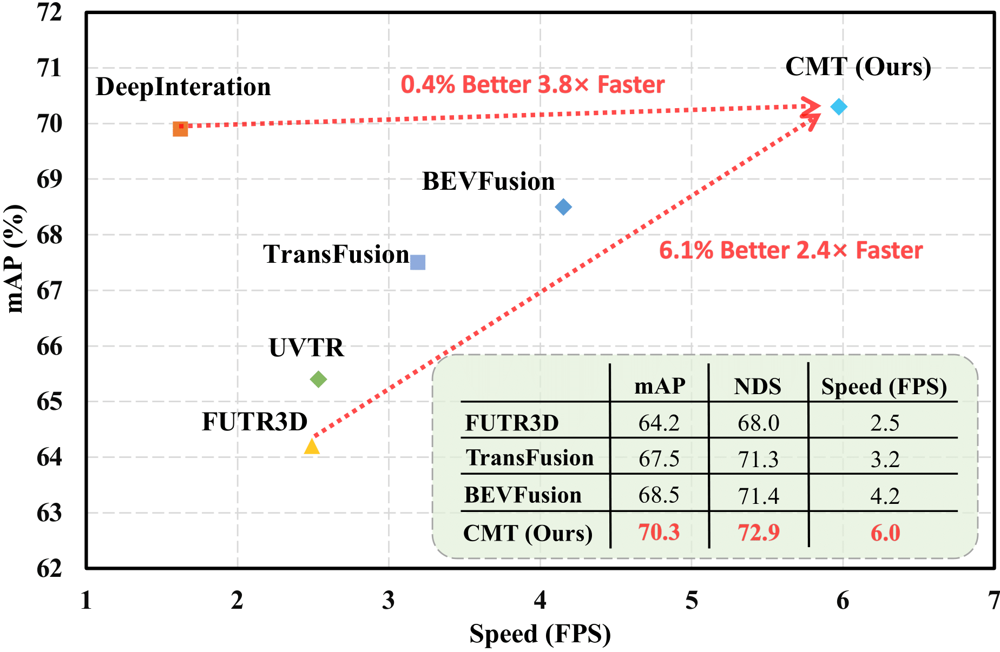

# Cross Modal Transformer: Towards Fast and Robust 3D Object Detection
[](https://arxiv.org/pdf/2301.01283.pdf)

<!-- ## Introduction -->

https://user-images.githubusercontent.com/18145538/210828888-a944817a-858f-45ef-8abc-068adeda413f.mp4

This repository is an official implementation of [CMT](https://arxiv.org/pdf/2301.01283.pdf).

CMT is a robust 3D detector for end-to-end 3D multi-modal detection. A DETR-like framework is designed for multi-modal detection(CMT) and lidar-only detection(CMT-L), which obtains **74.1%**(SoTA among all single models) and **70.1%** NDS separately on nuScenes benchmark.
Without explicit view transformation, CMT takes the image and point clouds tokens as inputs and directly outputs accurate 3D bounding boxes. CMT can be a strong baseline for further research.

<div align="center">
  
  <em> Overall framework </em>
</div><br/>


<div align="center">
  

  <em> Performance comparison between CMT and existing methods. All speed statistics are measured on a single
Tesla A100 GPU using the best model of official repositories.  </em>
</div><br/>


## Preparation

* Environments  
Python == 3.8 \
CUDA == 11.1 \
pytorch == 1.9.0 \
mmdet3d == 1.0.0rc5 \
spconv-cu111 == 2.1.21 \
[flash-attn](https://github.com/HazyResearch/flash-attention)

* Data   
Follow the [mmdet3d](https://github.com/open-mmlab/mmdetection3d/blob/master/docs/en/data_preparation.md) to process the nuScenes dataset.

You can download pkl files and image pretrain weights from [Google Drive](https://drive.google.com/drive/folders/1wTdG7oG-l-nMa_400jBwJk4mEQmA_xl3?usp=sharing).


## Main Results
Results on nuScenes **val set**. The default batch size is 2 on each GPU. The FPS are all evaluated with a single Tesla A100 GPU.

| Config            |Modality| mAP      | NDS     | Schedule|Inference FPS|
|:--------:|:----------:|:---------:|:--------:|:--------:|:--------:|
| [vov_1600x640](./projects/configs/camera/cmt_camera_vov_1600x640_cbgs.py) |C| 40.6% | 46.0%  | 20e | 8.4 |
| [voxel0075](./projects/configs/lidar/cmt_lidar_voxel0075_cbgs.py) |L| 62.14 | 68.6%    | 15e+5e | 18.1 |  
| [voxel0100_r50_800x320](./projects/configs/fusion/cmt_voxel0100_r50_800x320_cbgs.py)  |C+L| 67.9%     | 70.8%    | 15e+5e | 14.2 |
| [voxel0075_vov_1600x640](./projects/configs/fusion/cmt_voxel0075_vov_1600x640_cbgs.py)  |C+L| 70.3% | 72.9%    | 15e+5e | 6.0 |
## Citation
If you find CMT helpful in your research, please consider citing: 
```bibtex   
@article{yan2023cross,
  title={Cross Modal Transformer via Coordinates Encoding for 3D Object Dectection},
  author={Yan, Junjie and Liu, Yingfei and Sun, Jianjian and Jia, Fan and Li, Shuailin and Wang, Tiancai and Zhang, Xiangyu},
  journal={arXiv preprint arXiv:2301.01283},
  year={2023}
}
```

## Contact
If you have any questions, feel free to open an issue or contact us at yanjunjie@megvii.com, liuyingfei@megvii.com, sunjianjian@megvii.com or wangtiancai@megvii.com.
