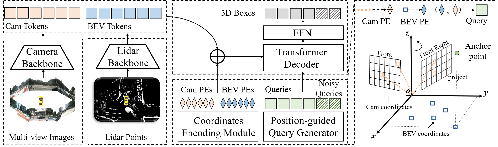

# Cross Modal Transformer via Coordinates Encoding for 3D Object Dectection

<!-- ## Introduction -->

https://user-images.githubusercontent.com/18145538/210828888-a944817a-858f-45ef-8abc-068adeda413f.mp4

This repository is an official implementation of [CMT](https://arxiv.org/pdf/2301.01283.pdf).

  

 

CMT is a robust 3D detector for end-to-end 3D multi-modal detection. A DETR-like framework is designed for multi-modal detection(CMT) and lidar-only detection(CMT-L), which obtains 73.0% and 70.1% NDS separately on nuScenes benchmark.
Without explicit view transformation, CMT takes the image and point clouds tokens as inputs and directly outputs accurate 3D bounding boxes. CMT can be a strong baseline for further research.

## Preparation

* Environments  
Python == 3.8, CUDA == 11.1, pytorch == 1.9.0, mmdet3d == 1.0.0rc5   

* Data   
Follow the mmdet3d to process the nuScenes dataset (https://github.com/open-mmlab/mmdetection3d/blob/master/docs/en/data_preparation.md).

## Main Results
We provide some results on nuScenes **val set**. The default batch size is 2 on each GPU.

| config            | mAP      | NDS     | GPU | schedule| time    | 
|:--------:|:----------:|:---------:|:--------:|:--------:|:--------:|
| CMT-pillar0200-r50-704x256 | 53.8%     | 58.5%    | 8 x 2080ti | 20 epoch| 13 hours  |  
| CMT-voxel0100-r50-800x320 | 60.1%     | 63.4%    | 8 x 2080ti | 20 epoch| 14 hours   |    
| CMT-voxel0075-vov-1600x640  | 69.4%     | 71.9%    | 8 x A100 | 15e+5e(with cbgs) | 45 hours  |    

## Contact
If you have any questions, feel free to open an issue or contact us at yanjunjie@megvii.com, liuyingfei@megvii.com, sunjianjian@megvii.com or wangtiancai@megvii.com.
